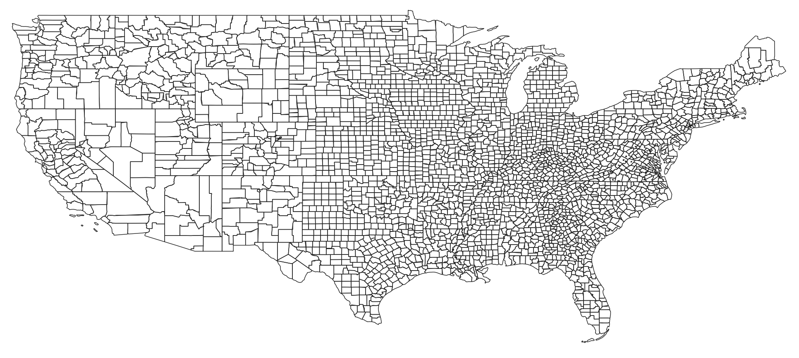

# Exploring relationship between Place Connectivity Index (PCI) and impact of COVID-19

### Group Project for Geoinformatics Summer School - 2024 Wuhan, China
============================================================
    
#### Group 3

- Kshitij Raj Sharma (Nepal)
- Ilya Ilyankou (Belarus)
- Rheecha Sharma (Nepal)
- Tang Yongli (China)

---

## Table of Contents
* [Introduction](#introduction)
* [Objective](#objective)
* [Study Area](#study-area)
* [Methodology](#methodology)
* [Results](#results)
* [Conclusion](#conclusion)
* [Glossary](#glossary)

---

## Introduction 

Place Connectivity Index (PCI) based on spatial interactions among places can provide valuable insights in flow of population with respect to time. PCI offers a unique lens through which to examine the complex factors influencing the COVID-19 pandemic. This study seeks to investigate the relationship between PCI and the pandemic's impact.

While it is often assumed that areas with higher PCI will have a higher population density, Higher movements (flow of moving population),  leading to a higher death rate, higher PCI is also associated with higher economic and educational levels, which may enable these areas to better combat the pandemic.

---

## Objective

This study aims to investigate the relationship between Place Connectivity Index (PCI) and the death ratio of COVID-19, with a focus on how this relationship changes over time and varies by different factors including availablity of hospitals , wealth of residing people in the area. Specifically, our objectives are to:

- We are trying to understand which are the cities with High PCI , Are they wealthier ? Do they have more infrastructure , Does the covid death count reacted accordnigly or in contrast ? 

---

## Study Area
Lower 48 region of US. [Reference](https://www.census.gov/geographies/mapping-files/time-series/geo/carto-boundary-file.html)

---
## Methodology

###

---

## Results

### 
---

## Conclusion

### 
---

## Glossary

### PCI 
Place Connectivity Index : 
Measure of spatial interactions among places due to intense human movement.
[Reference](https://github.com/GIBDUSC/Place-Connectivity-Index)

### GWR 

Geographically weighted regression (GWR): It is a spatial analysis technique that takes non-stationary variables into consideration (e.g., climate; demographic factors; physical environment characteristics) and models the local relationships between these predictors and an outcome of interest. [Reference](https://www.publichealth.columbia.edu/research/population-health-methods/geographically-weighted-regression)
