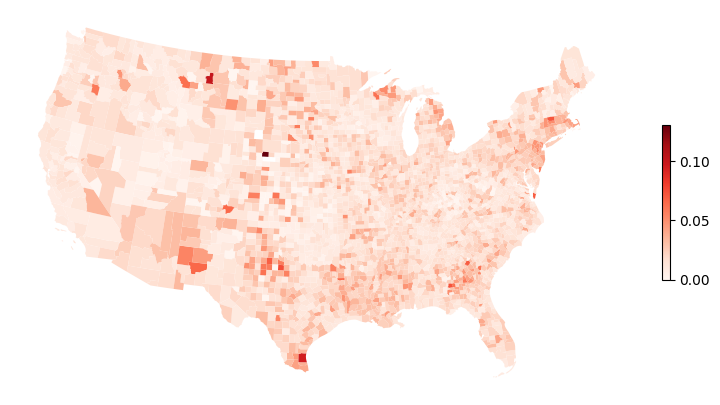
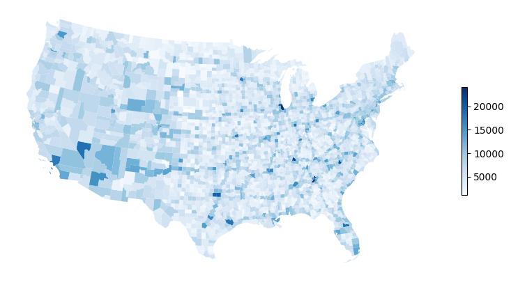
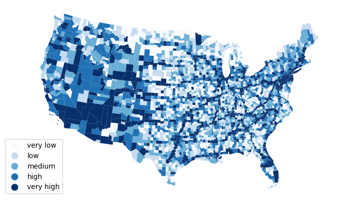
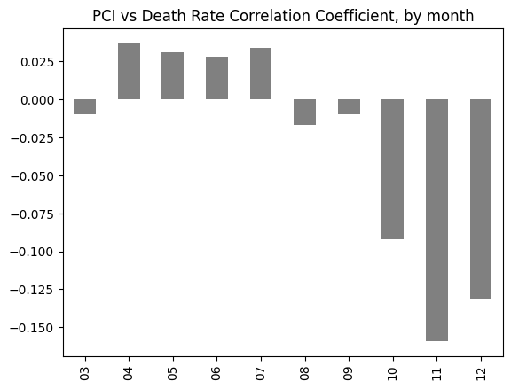
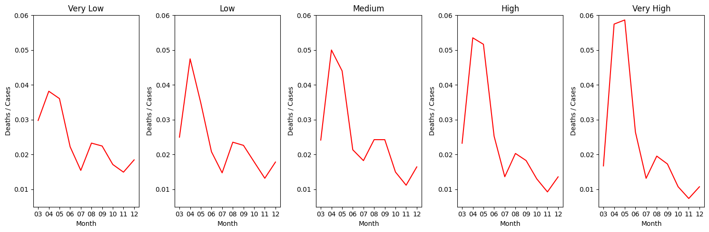
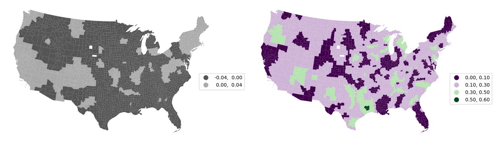
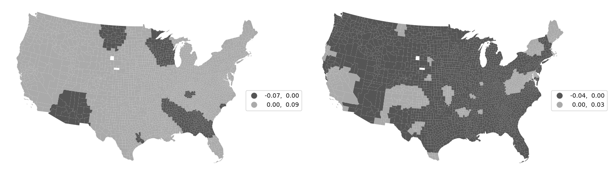
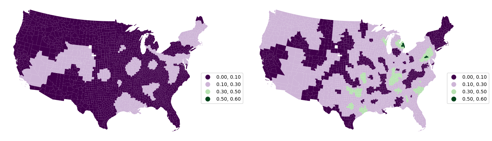

# Exploring the relationship between Place Connectivity Index (PCI) and  Covid-19 impact in the US 🦠🇺🇸

Group 3 Project &bull; 2024 Geoinformatics Summer School (SSII) at Wuhan University, China

**Ilya Ilyankou** 🇧🇾🇬🇧 &bull; **Tang Yongli** 🇨🇳 &bull; **Kshitij Raj Sharma** 🇳🇵 &bull; **Rheecha Sharma 🇳🇵**

---

# 👋 Introduction 

[Place Connectivity Index (PCI)](https://www.researchgate.net/publication/349124701_Measuring_Global_Multi-Scale_Place_Connectivity_using_Geotagged_Social_Media_Data) quantifies the strength of spatial interactions among locations.

In this project, we investigate the relationship between place connectivity and Covid-19 deaths rates, and how this relationship changed throughout 2020, the first year of the pandemic in the US, and for various regions of the US.

While it is fair to assume that highly-connected places may suffer more from the pandemic due to greater human mobility and as such virus spread, the reality is more complex.

---

# 🎯 Our study aims to:

* Characterise high- and low-PCI places in the United States,
* Investigate how the Covid-19 death-to-case ratio changed for highly- and poorly-connected areas throughout 2020, and
* Suggest how places can better prepare for the next pandemic.

---

# Methodology

---

# 1. Evaluate the correlation between PCI and death-to-case ratio

- Use Pearson correlation coefficient to estimate the strength of the relationship between the two variables between March and December 2020
- Check how the relationship changes between months

---

# 2. Perform T-tests and ANOVA

- Use T-test to assess whether the Pearson correlation coefficient between PCI and Covid-19 death-to-case ratio is statistically significant.
- Use ANOVA to assess whether the death-to-case ratio between different PCI groups is statistically significant, by month.

---

# 3. Perform Geographically Weighted Regression

- GWR assumes that the relationship between variables may change over space due to spatial heterogeneity, and perforns separate regressions for each location, paying *more* attention to nearby observations.
- To better understand spatial heterogeneity between PCI and the death-to-case ratio, we fit three GWR models:
    - for the whole year (March-December 2020),
    - for the first three months of the pandemic (March-May 2020)
    - for the final three months of 2020 (October-December 2020)

---

# Findings 🚀

---

# Deaths/Cases Ratio, March—December 2020

###### *Source: 2018 county boundaries (US Census); NYTimes Covid-19 counts by county (2020)*

---

# Aggregated Place Connectivity Index

We aggregated PCI values to get a **single connectivity index value** for each county

###### *Source: 2018 county boundaries (US Census Bureau); 2019 PCI by Li et al.*
---

# Grouped Aggregated Place Connectivity Index

We then grouped counties based on their PCI quintile: very low (0-20%), low (20-40%), medium (40-60%), high (60-80%), very high (80-100%)

###### *Source: 2018 county boundaries (US Census Bureau); 2019 PCI by Li et al.*
---

## Higher PCI is associated with younger, wealthier, and better educated population with better access to healthcare

|PCI Group| 👵 Age |💰 Income | ⛑️ Insured *%*| 🎓 *%*| 🏥 hosp. beds *per 100k*|
|--|--:|--:|--:|--:|--:|
|very low | 43.7 | $48,189  |	89.6 |	17.1 | 207 |
|low |	42.7 |	$49,544  |	90.2 |	18.8 | 262 |
|medium |	41.6 |	$52,535  |	90.7 |	21.5 | 274 |
|high |	40.4 |	$56,166  |	91.0 |	23.7 | 282 |
|very high |	38.9 |	$60,144 |	90.8 |	28.7 | 362 |

###### *Source: 2019 ACS, 5-year estimates (US Census Bureau); Kaggle*

---

# The correlation coefficient between PCI and deaths/cases for Ma—Dec 2020 is -0.0998

*This coefficient passed the t-test at p-value <0.00001*

## In other words, overall in the first nine months of the pandemic, higher place connectivity is associated with fewer deaths after testing positive.

---

# PCI vs Death Rate Correlation Coefficient (monthly)

---

# Statistical significance

According to the T-tests, the relationship between PCI and deaths-to-cases ratios was statistically significant *(p-value <0.001)* in the last three months of 2020.

|Month|Mar|Apr|May|Jun|Jul|Aug|Sep|Oct|Nov|Dec|
|:--|--|--|--|--|--|--|--|--|--|--|
|**P-value**|0.08|0.01|0.2|0.4|0.02|0.91|0.29|<0.001|<0.001|<0.001|
|**Signif.**|⛔️|✅|⛔️|⛔️|✅|⛔️|⛔️|✅|✅|✅

---

# Deaths/Cases Ratios by PCI Group by Month

At the start of the pandemic, lower-PCI places experienced fewer deaths per positive case, compared to higher-PCI places. By the end of the year, the trend has reversed.

###### According to ANOVA, all PCI group differences by month are statistically significant

---

# Why this trend?

* At the beginning of the pandemic, **fewer people had access to Covid testing and nobody knew how to look after Covid patients**, so it is not surprising that through the year the death-to-case ratio would decrease for all types of areas
* Better-connected places are visited by more people, spreading the virus faster, hence **higher death rates**
* As Covid testing became widespread and we learned what works (and what doesn't) for Covid patients, better-connected places with their younger and wealthier population (and better access to healthcare) became well equipped to deal with the pandemic

---

# GWR Beta Coefficient & Local R2, Mar-Dec 2020

###### 

---

# GWR Beta coefficients, Mar-May vs Oct-Dec 2020

###### Note: Coefficients represent how much PCI impact Covid-19 deaths per positive case. Positive coefficients represent positive relationships, and vice-versa.

---

# GWR Local R2, Mar-May vs Oct-Dec 2020

###### Note: Purples represent weaker linear relationship between PCI and death/case ratio, while greens represent stronger relationship

---

# Conclusion
 
- At the beginning of the pandemic, better-connected places were hit harder.
    - Even though these places house wealthier and younger population with better access to healthcare, the density and human mobility help the virus spread faster

- However, overall in the first 9 months of the pandemic, we show that **better-connected places generally have lower death rates**
    - The evidence becomes clearer at the end of 2020, during the second Covid wave

- We suggest the government should focus more on less-connected (rural and often poorer) areas during the next pandemic, such as improving access to healthcare, and strenghening health education and awareness
---

# Thank you! Any questions?

You can find these slides, and the source code on GitHub: https://github.com/ilyankou/wuhan-geoinformatics

